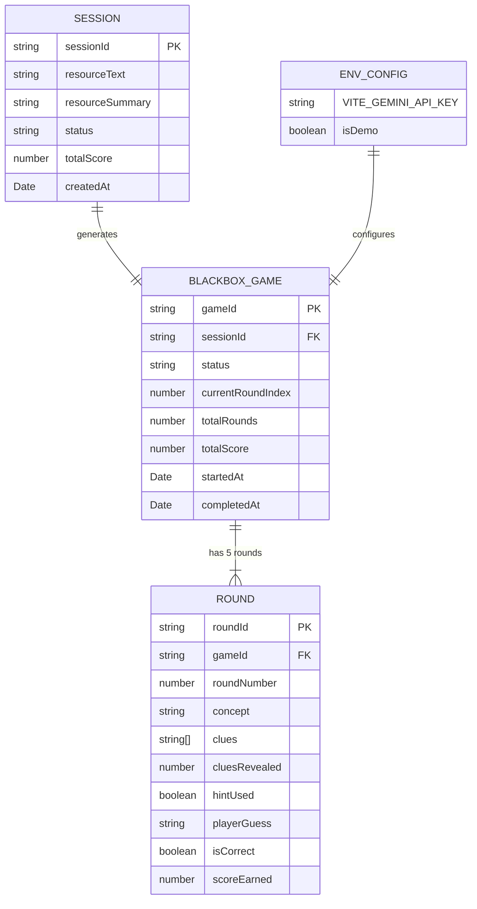
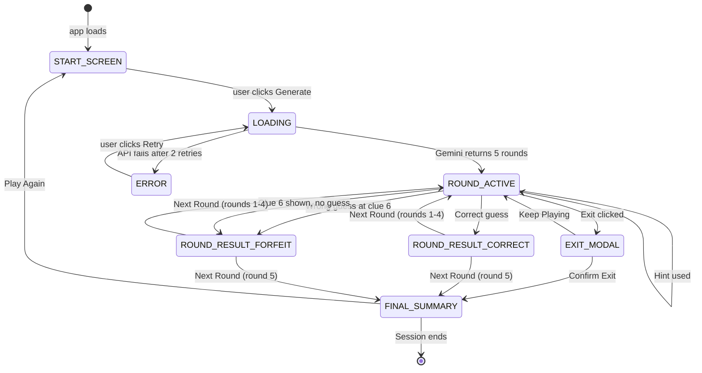
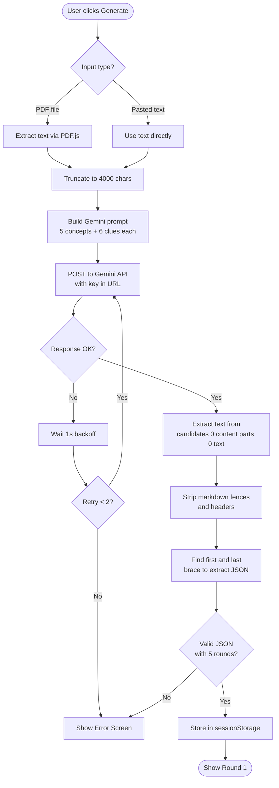
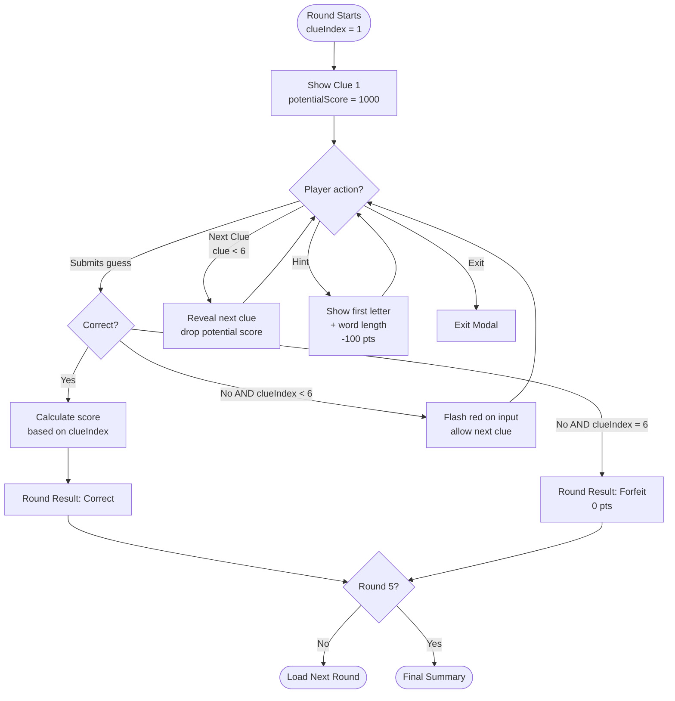
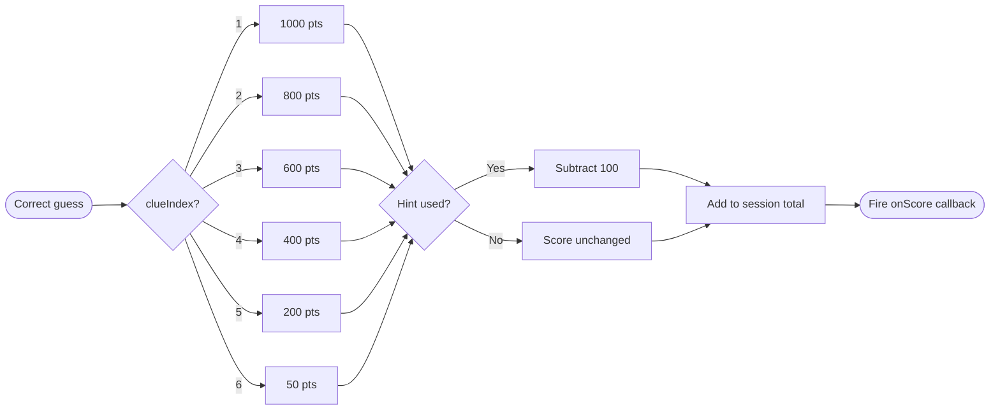
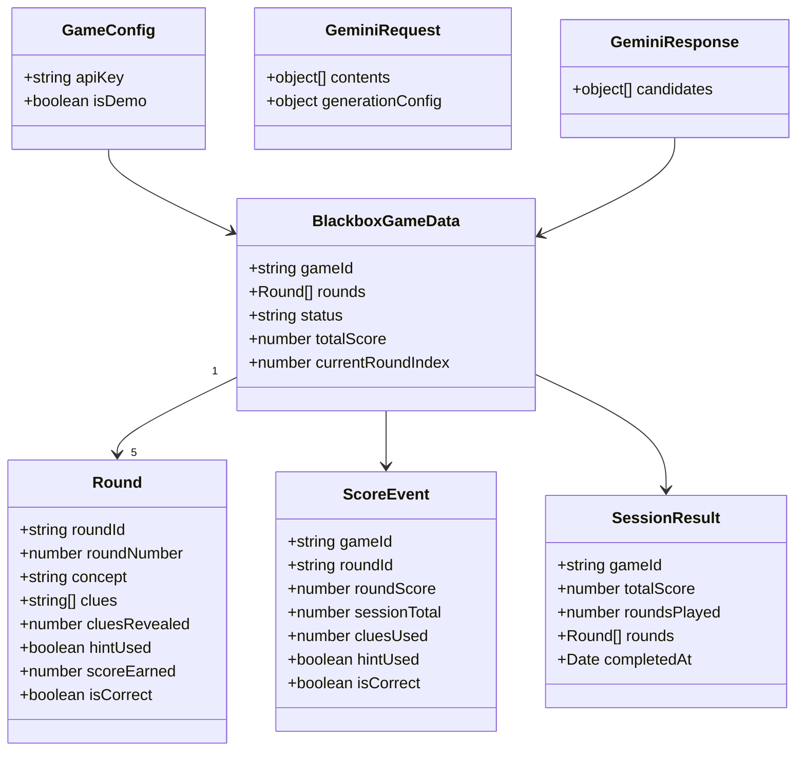
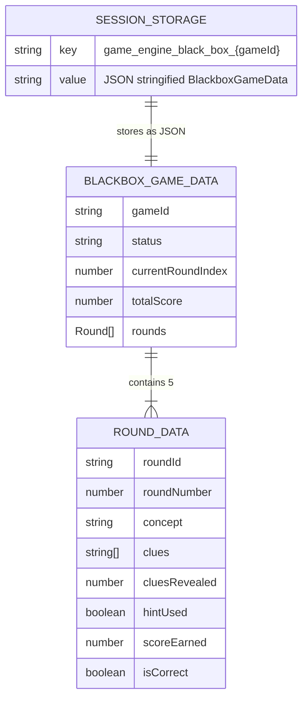

# Schema — Black Box Game (G4) v2

> ER Diagrams, State Machine, and Flowcharts in Mermaid

---

## 1. Core Data Model

---

## 2. Game State Machine

---

## 3. Gemini API Generation Flow

---

## 4. Round Gameplay Flowchart

---

## 5. Scoring Logic

---

## 6. TypeScript Type Hierarchy

---

## 7. Session Storage Schema

